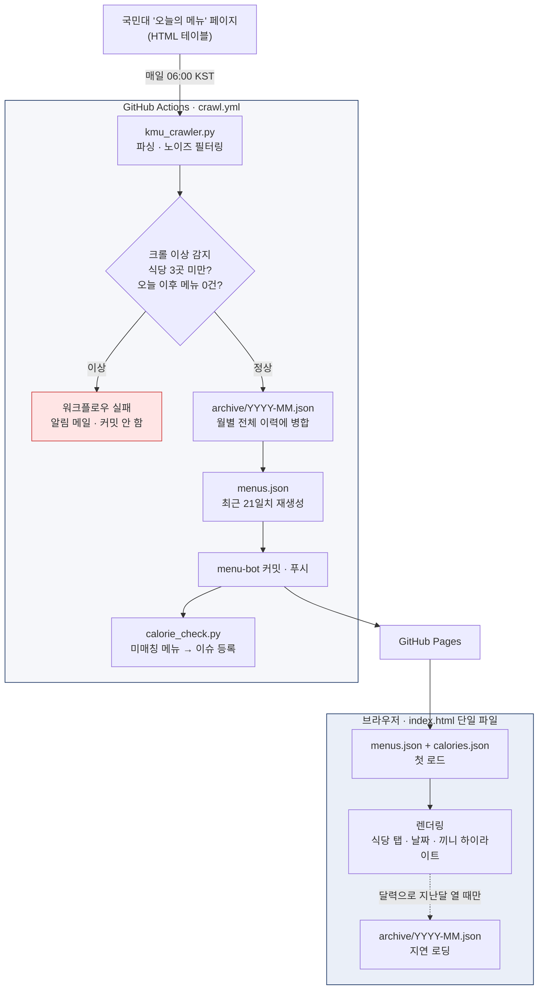

# 국민대 오늘의 학식 🍚

국민대학교 교내 식당 7곳의 오늘 메뉴·가격을 매일 자동으로 모아 보여주는 정적 웹사이트.

[](https://buildtwenty.github.io/kmu-menu/)
[](../../actions/workflows/crawl.yml)
[](requirements.txt)
[](index.html)

학교 홈페이지의 '오늘의 메뉴' 표는 PC 화면 기준이라 휴대폰에서 보기 번거롭고, 지난 메뉴를 다시 찾아볼 수도 없다. 매일 새벽 한 번 크롤링해서 읽기 좋은 형태로 다시 그려주는 게 전부인 프로젝트다.

<br>

## 주요 기능

[스크린샷]

- **식당별 탭 · 날짜 선택** — 학생식당 / 한울 / 교직원 / 청향 한식·양식 / K-Bob+ / 생활관식당
- **현재·다음 끼니 자동 하이라이트** — 접속한 시각을 보고 지금 먹을 수 있는 끼니를 먼저 보여준다
- **칼로리 추정 토글** — 메뉴명 키워드로 대략적인 범위를 표시 (공식 영양정보가 아닌 추정치)
- **지난 메뉴 조회** — 달력으로 과거 날짜 탐색, 월별 아카이브를 필요할 때만 내려받는다
- **공유하기** — 식당·끼니를 고르면 카톡에 붙여넣기 좋은 텍스트로 만들어 준다
- **주말·휴무 처리** — 학교 표가 주말 칸에도 평일 메뉴를 복사해 넣는 걸 걸러낸다

| 메뉴 화면 | 달력 · 과거 조회 | 공유 시트 |
|---|---|---|
| [스크린샷] | [스크린샷] | [스크린샷] |

<br>

## 아키텍처

빌드 과정도, 서버도, 데이터베이스도 없다. GitHub Actions가 크롤러를 돌려 JSON을 저장소에 커밋하고, GitHub Pages가 그 JSON과 HTML 한 장을 그대로 서빙한다.



**데이터 스키마** (크롤러 ↔ 프론트엔드 계약. 이걸 바꾸면 양쪽을 같이 고쳐야 한다):

```json
{ "fetched_at": "2026-09-14T06:00:00+09:00",
  "restaurants": [
    { "name": "한울식당(법학관 지하1층)",
      "menus": [ { "date": "2026-09-14", "corner": "5코너 GUKBAP.Chef", "meal": "중식",
                   "items": [ { "name": "수육국밥", "price": 6000 } ] } ] } ] }
```

<br>

## 기술적으로 신경 쓴 것들

### 원본이 '표'가 아니라 '텍스트 덩어리'다

학교 페이지의 셀 하나에는 메뉴·운영시간·공지·알레르기 문구·장식 문자가 `<br>`로 전부 이어 붙어 있다. 그래서 크롤러의 대부분은 파싱이 아니라 **음식과 노이즈를 가르는 필터**다.

- 공지·운영시간·공휴일 단독 표기(`제헌절`)·판촉 문구(`New`, `★여름간식판매★`)를 줄 단위로 걸러낸다
- 앵커를 써서 과도한 제거를 막는다 — 예를 들어 `판매`를 그냥 지우면 `철판매운오돈볶음`이 잘려 나가므로 토큰 단위로 한정한다
- 가격(`￦5,500` 또는 줄 끝 4~5자리 숫자)을 만나는 시점에 이름 버퍼를 flush 하는 방식으로 세트 구성품을 한 메뉴로 묶는다

### 원본 마크업이 깨지는 경우까지 방어

각 셀은 같은 내용을 hidden `<input>`의 속성값과 표시 텍스트로 **두 번** 담고 있는데, 이 속성값이 이스케이프되어 있지 않다. 메뉴명에 큰따옴표가 들어간 날(`"Healthy Green Salad &드레싱2종"`)에는 속성이 거기서 끊겨 나머지가 본문으로 새어 나오고, `}" />` 같은 조각이 메뉴처럼 저장됐다.

파싱 전에 hidden input을 통째로 걷어내 원인을 없애고, 그 밖의 깨짐에 대비해 **글자가 하나도 없이 마크업 기호만 남은 항목**을 버리는 일반 안전망을 뒀다. 숫자만 있는 줄(`2` 같은 수량 표기)은 남긴다.

### 월별 아카이브 병합

첫 로딩을 가볍게 하려고 `menus.json`에는 최근 3주만 담고, 전체 이력은 `archive/YYYY-MM.json`에 월별로 쌓는다. 병합은 `(식당명, 날짜, 코너)`를 키로 **새 데이터가 이기되 과거 날짜는 보존**한다. 지난달 메뉴는 달력을 열 때만 지연 로딩한다.

필터를 새로 추가해도 이미 저장된 데이터에는 소급 적용하지 않는다 — 과거 데이터를 자동으로 변형하는 건 위험해서, 필요할 때 일회성 정리 스크립트로 처리한다.

### 칼로리 토큰 매칭

메뉴명을 공백과 `/`로 자른 뒤 **키워드가 걸리는 첫 토큰**을 주메뉴로 보고, 그 토큰 안에서 가장 긴 키워드를 고른다. 전역 최장일치가 아닌 이유는 세트 끝의 `그린샐러드` 같은 긴 사이드 키워드가 주메뉴를 가리기 때문이다.

이 규칙 때문에 키워드를 늘릴 때는 매번 **저장된 전체 메뉴명(현재 880개)에 대해 추가 전/후를 비교**한다. 실제로 걸러낸 사례들:

- `꼬치어묵`을 넣으면 `얼큰꼬치어묵우동`이 우동(400~600)에서 어묵(200~350)으로 **내려간다** → 단품만 정확 매칭
- `계란`은 `계란후라이` 같은 사이드가 앞 토큰을 가로채 세트 전체를 사이드 칼로리로 표시한다 → `삶은계란`만 추가
- `커리`는 `치커리겉절이`와 충돌 → `커리정식`으로 한정
- 짧은 키워드가 기존 항목을 잠식하면 방어용 키워드를 같이 넣는다 (`치밥` 추가 시 `김치밥버거`를 위해 `밥버거`도 함께)

### 조용한 실패를 막는 크롤 이상 감지

학교 페이지가 개편되면 크롤러는 **에러 없이 빈 결과**를 낼 수 있다. 게다가 아카이브 병합 구조라 결과가 비어도 `menus.json`은 과거 데이터로 그럴듯하게 채워진다. 그래서 커밋 **전에** 이번 크롤이 새로 긁어온 양(`crawl_stats.json`)을 따로 보고, 식당 3곳 미만이거나 오늘 이후 메뉴가 0건이면 워크플로우를 실패시킨다. 낡은 데이터로 덮어쓰지 않고 알림만 온다.

### 칼로리 미매칭 자동 리포트

새 메뉴가 칼로리 키워드에 안 잡히면 `calorie_check.py`가 목록을 만들어 GitHub 이슈로 등록/갱신한다. 사람이 매일 확인하지 않아도 누락이 쌓이지 않는다.

<br>

## 로컬에서 실행

```bash
pip install -r requirements.txt   # requests, beautifulsoup4 (CI는 Python 3.12)
python kmu_crawler.py             # 라이브 사이트 크롤 → menus.json 갱신 + 요약 출력

python -m http.server 8000        # 미리보기: http://localhost:8000/index.html
```

`index.html`이 `menus.json`을 `fetch()`하므로 `file://`로 열면 동작하지 않는다. 크롤러는 오프라인 픽스처가 없어서 항상 라이브 페이지를 친다 — 파서를 고칠 때는 실제 크롤로 검증해야 하고, 소스 HTML이 정답이다.

<br>

## 파일 구성

| 파일 | 역할 |
|---|---|
| `kmu_crawler.py` | 크롤 + 노이즈 필터링 + 아카이브 병합 + `menus.json` 재생성 |
| `calorie_check.py` | 칼로리 미매칭 메뉴 탐지 (이슈 본문 생성) |
| `migrate_to_archive.py` | (일회성) 구 `menus.json` → 월별 아카이브 이전 |
| `index.html` | 단일 파일 뷰어 (인라인 CSS/JS, 외부 의존성 없음) |
| `menus.json` / `archive/` | 최근 3주 / 월별 전체 이력 |
| `calories.json` | 메뉴 키워드 → 칼로리 범위 매핑 |
| `.github/workflows/crawl.yml` | 매일 06:00 KST 자동 갱신 |

파싱 규칙과 내부 개발 메모는 [`CLAUDE.md`](./CLAUDE.md)에 정리해 두었다.

<br>

## 데이터 출처 및 고지

- 메뉴 데이터 출처: [국민대학교 '오늘의 메뉴'](https://www.kookmin.ac.kr/user/unLvlh/lvlhSpor/todayMenu/index.do)
- **이 사이트는 국민대학교와 무관한 비공식 개인 프로젝트입니다.** 학교나 식당 운영업체의 검수를 받지 않았습니다.
- 메뉴·가격은 원본 페이지를 그대로 옮긴 것이며, 현장 사정으로 실제와 다를 수 있습니다. 하루 한 번만 갱신하므로 당일 변경은 반영되지 않습니다.
- **칼로리는 메뉴명 키워드로 계산한 추정치**로, 공식 영양성분 정보가 아닙니다. 참고용으로만 봐주세요.
- 방문 통계는 GoatCounter로 익명 집계하며, 개인정보는 수집하지 않습니다.

잘못된 정보나 개선 아이디어는 [이슈](../../issues)로 알려주세요.
